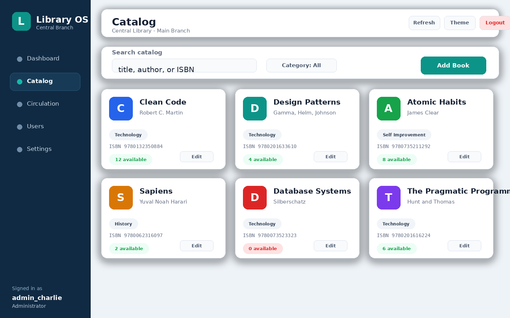
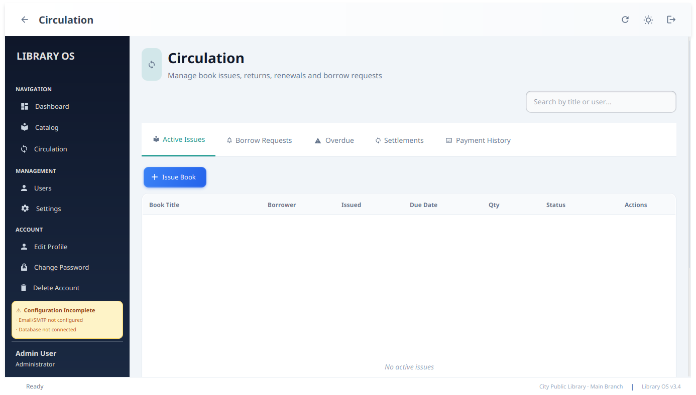

# Library OS


Library OS is a cross-platform JavaFX desktop application for running a branch-based library workflow. It combines catalog management, circulation, borrow requests, fines, payment approvals, invoices, user administration, backups, migration packages, email notifications, and optional database mirroring in one native desktop app.

The application is designed around one important rule: the library registry is global, while operational data is scoped to the selected library branch. That allows one installation to switch between branches without mixing books, users, requests, settings, or issue records.

## Screenshots

These are representative documentation screenshots using sample data and the same screen concepts implemented in `src/main/java/com/example/application/ui`.

| Login and branch selection | Staff dashboard |
| --- | --- |
|  |  |

| Catalog management | Circulation workflow |
| --- | --- |
|  |  |

## Table of Contents

- [What Library OS Provides](#what-library-os-provides)
- [User Roles](#user-roles)
- [Application Workflow](#application-workflow)
- [Feature Guide](#feature-guide)
- [Storage and Data Model](#storage-and-data-model)
- [Security Model](#security-model)
- [Installation](#installation)
- [Running From Source](#running-from-source)
- [Configuration](#configuration)
- [Developer Guide](#developer-guide)
- [Testing](#testing)
- [Troubleshooting](#troubleshooting)
- [License](#license)

## What Library OS Provides

Library OS focuses on day-to-day library operations:

- Branch-aware startup, setup, and login.
- Role-aware UI for patrons, librarians, restricted administrators, and administrators.
- Catalog management with book creation, editing, deletion safeguards, search, and category filters.
- Borrow requests that can be approved, rejected, or fulfilled directly during issue.
- Active issue tracking with renewals, partial returns, overdue status, and fine calculation.
- Fine settlement workflows with staff approvals, payment history, printable receipts, and optional email invoices.
- Staff dashboards with inventory metrics, circulation trends, overdue insights, recent activity, and reminders.
- User management with account approval, role changes, status control, protected last-admin handling, and deletion safeguards.
- SMTP-based notifications for overdue reminders, password reset, OTP verification, payment receipts, and staff alerts.
- Export, backup, restore, seed data, and encrypted `.lms` migration packages.
- Local file persistence with optional SQLite, MySQL, PostgreSQL, Oracle, or MongoDB snapshot mirroring.
- Native packaging for Windows, Linux, and macOS through `jpackage`.

## User Roles

| Role | Intended user | Main access |
| --- | --- | --- |
| `USER` | Library member or patron | Browse catalog, create borrow requests, view personal loans, view overdue items, submit fine payment requests, print receipts, and manage their own profile. |
| `LIBRARIAN` | Circulation staff | Access staff dashboard, catalog operations, issue/return/renew flows, request approvals, reminders, reports, fine settlement queues, and staff settings screens. |
| `RESTRICTED_ADMIN` | Branch manager or limited administrator | Treated as an admin-capable staff role in code for protected operations while still carrying a distinct display role. |
| `ADMIN` | Full administrator | Full staff access, user administration, library configuration, data management, and protected account operations. |

The first account created in a fresh library becomes an administrator. Later staff accounts can be marked pending so they require approval before normal use. The application also prevents deleting or deactivating the last active administrator.

## Application Workflow

### First launch

On the first run, the app shows a setup wizard instead of the login screen. Staff setup collects:

- Library name.
- Branch name.
- Data directory.
- Export directory.
- Administrative library secret.
- Optional database settings.
- Optional import from a `.lms` migration package.
- Optional import from an already configured database snapshot.

After setup, the branch is registered in the global `LibrariesDB` registry and appears in the login branch selector.

### Login

The login screen is branch-aware. Users choose a library branch before signing in, then the app loads branch-specific configuration, users, books, borrow requests, issue records, and payment approval data.

Regular `USER` accounts are intended for multi-machine/member workflows and the app enforces remote database mode for those accounts. Staff accounts can run in local file mode for single-machine administration.

### Main shell

After login, the shell provides:

- Sidebar navigation for Dashboard, Catalog, and Circulation.
- Staff-only navigation for Users and Settings.
- Account actions for profile editing, password change, and account deletion.
- Header actions for back, refresh, theme toggle, and logout.
- Status text with library/branch context and last sync information.
- Automatic refresh every 60 seconds.
- Toast notifications for success, error, warning, and info messages.

## Feature Guide

### Dashboard

The dashboard adapts to the current role.

Staff see operational metrics:

- Total books, copies, available copies, issued copies, overdue loans, fine balance, unpaid settlements, pending requests, and registered users.
- Category distribution by inventory, available, issued, and overdue counts.
- Circulation trends over selectable ranges such as 7, 30, 90 days, 12 months, or all data.
- Grouping by daily, weekly, monthly, or automatic buckets.
- Recent activity and overdue/unsettled fine panels.
- Reminder actions for overdue users when SMTP is configured.

Patrons see personal metrics:

- Currently borrowed books.
- Overdue books.
- Outstanding fine balance.
- Pending borrow requests.

### Catalog

The catalog view supports:

- Searching by title, author, or ISBN.
- Filtering by category.
- Saved/default category lists.
- Responsive book-card layout.
- Add, edit, and delete actions for staff.
- Request action for patrons when copies are available.

Book records include ISBN, title, author, category, quantity, and optional fields such as publisher, description, price, and location. Deleting a book is blocked when issued copies still exist.

### Circulation

The circulation module is the core operational screen. It includes tabs for:

- Active Issues.
- Borrow Requests.
- Overdue.
- Settlements.
- Payment History.
- Patron-specific overdue, fine, and receipt views.

Staff can:

- Issue one or more books to a user.
- Match an issue action to a pending borrow request.
- Return books fully or partially.
- Renew loans.
- Approve or reject borrow requests.
- Add rejection notes.
- Send overdue reminders.
- Export overdue reports as CSV.
- Print overdue reports.
- Process fine payments.
- Approve or reject payment requests submitted by patrons.

The return flow supports partial returns by splitting issue records where needed. Overdue fines are calculated dynamically for active overdue items and fixed once the item is returned.

### Borrow Requests

Patrons can request available books from the catalog. Requests track:

- Request ID.
- ISBN and book title.
- User ID.
- Quantity.
- Requested time.
- Status: pending, approved, or rejected.
- Processing user, processing time, and optional note.

Staff may approve a request directly or fulfill it as part of the issue workflow. Processed requests are archived when the active list grows beyond configured limits.

### Fines, Payments, and Invoices

Library OS tracks both active overdue fines and returned-but-unsettled fines.

Supported workflows:

- Staff can record fine payments directly.
- Patrons can submit payment approval requests.
- Staff can approve or reject submitted payments.
- Receipts can be printed.
- Payment invoices can be emailed when SMTP is configured.
- Invoice history is retained for recent payment history views.

The default borrowing configuration is 5 books per user, 14 loan days, and a fine rate of 2.00 per overdue day. These values are initialized in the branch configuration and can be changed from library settings where supported by the UI.

### User Management

Staff can manage user accounts from the Users view:

- Search accounts.
- Add users.
- Approve pending staff accounts.
- Edit profile fields.
- Change roles.
- Activate/deactivate accounts.
- Delete users when business rules allow it.

Deletion is blocked for users with active loans or pending requests. Administrator protection prevents removing the final active admin account.

### Library Settings

The settings area includes:

- Profile, password, and account deletion tools for the signed-in user.
- User management.
- Library configuration.
- Data management.
- About/application details.

Library configuration includes tabs for:

- Rules and currency.
- SMTP/email.
- Storage and data directories.
- Database engine and connection details.

### Email Notifications

Email is handled through Jakarta Mail / Eclipse Angus Mail. SMTP settings include host, port, username, encrypted password, from address, authentication, and STARTTLS.

Email-backed workflows include:

- OTP verification during registration.
- Temporary password emails for password reset.
- Overdue reminders.
- Payment invoice emails.
- Staff notifications for submitted payment approvals.
- Account approval notifications.

If SMTP is not configured, the rest of the application remains usable and email-dependent actions report configuration-friendly errors.

### Data Management

The Data Management view includes:

- Operational statistics for books, copies, available copies, issued copies, users, and overdue items.
- CSV report export for overdue books, issued books, and borrow requests.
- Manual backup creation.
- Backup restore.
- Import from configured database.
- Seed sample books and users.
- Save-now persistence action.
- Encrypted migration package export/import.

Restore and migration flows may ask for an application restart so all branch-scoped singletons reload cleanly.

## Storage and Data Model

### Local persistence

Library OS stores Java serialized data under OS-specific application directories. The app creates these directories automatically.

| Platform | Application data | Logs |
| --- | --- | --- |
| Windows | `%APPDATA%\LibraryOS` | `%LOCALAPPDATA%\LibraryOS\logs` |
| macOS | `~/Library/Application Support/LibraryOS` | `~/Library/Logs/LibraryOS` |
| Linux | `$XDG_DATA_HOME/LibraryOS` or `~/.local/share/LibraryOS` | `$XDG_STATE_HOME/LibraryOS/logs` or `~/.local/state/LibraryOS/logs` |

Set `-Dlibraryos.home=/custom/path` to redirect the app home. When this override is active, logs are written to `<appHome>/logs`.

### Branch isolation

Each branch receives a stable branch ID. Branch data is stored below the configured data directory using that branch ID, so renaming a branch does not orphan its data.

Common files include:

- `libraries_db.ser` - global registry of known libraries and branches.
- `app_config.ser` - branch application configuration.
- `branch_config.ser` - branch rules and SMTP-related settings.
- `users_db.ser` - users and roles.
- `books_db.ser` - catalog records and borrowing rules.
- `issued_books.ser` - active issued-book mapping.
- `borrower_details.ser` - borrower summary data.
- `issue_records.ser` - detailed issue/return/fine records.
- `borrow_requests.ser` - active borrow requests.
- `borrow_requests_archive.ser` - archived processed requests.
- `payment_approvals.ser` - submitted fine payment approvals.

Writes use a temporary file and move strategy to reduce corruption risk. Reads and writes are protected by a `ReentrantReadWriteLock`.

### Optional database support

Database support is snapshot-based. When a database is configured, serialized snapshots are mirrored to a table or collection called `libraryos_snapshots`. On read, the app tries the database snapshot first and falls back to local files when needed.

Supported engines:

- `NONE` - local file storage only.
- `SQLITE` - embedded SQLite file.
- `MYSQL` - MySQL or MariaDB through JDBC.
- `POSTGRESQL` - PostgreSQL through JDBC.
- `ORACLE` - Oracle Database through JDBC.
- `MONGODB` - MongoDB sync driver.

The database configuration can be edited in the UI or overridden with `<appHome>/config/database.properties`.

Example:

```properties
db.engine=POSTGRESQL
db.host=127.0.0.1
db.port=5432
db.database=libraryos
db.username=libraryos_app
db.password=change-me
db.ssl=false
db.dualWrite=true
db.sqlite.file=library.db
```

`db.dualWrite=true` keeps local `.ser` files synchronized as a fallback. Remote database mode is the intended setup for member workstations and regular patron accounts.

## Security Model

Library OS includes several application-level protections:

- Passwords are hashed with PBKDF2-HMAC-SHA256, per-user random salts, 10,000 iterations, and 256-bit output.
- Older SHA-256/plain legacy password paths are handled for migration compatibility where implemented.
- Sensitive user fields such as email and contact number are encrypted before serialization.
- Database credentials are encrypted before being serialized.
- Snapshot payloads written to external databases are encrypted.
- Migration packages use encrypted `.lms` files with a password-derived key.
- AES-GCM is used for authenticated encryption.
- The library master key can come from setup, `-Dlibrary.secret`, `LIBRARY_OS_SECRET`, or a machine-specific fallback.
- Last-active-admin protections reduce accidental lockout.
- Users with active loans or pending requests cannot be deleted.
- Rotating logs are written through `LoggingConfigurator`.

For multi-machine use, configure a shared library secret or import through a `.lms` package so encrypted data remains decryptable across devices.

## Installation

Download the latest release from the [**GitHub Releases page**](https://github.com/Yoge-2004/lms-javafx/releases/tag/v3.4.0).

| Platform | Package | Install command or action |
| --- | --- | --- |
| Windows | [LibraryOS-3.4.0.exe](https://github.com/Yoge-2004/lms-javafx/releases/download/v3.4.0/LibraryOS-3.4.0.exe) | Run the installer and follow the setup wizard. |
| Debian/Ubuntu/Zorin | [libraryos_3.4.0_amd64.deb](https://github.com/Yoge-2004/lms-javafx/releases/download/v3.4.0/libraryos_3.4.0_amd64.deb) | `sudo apt install ./libraryos_3.4.0_amd64.deb` |
| Fedora/RHEL/CentOS | [libraryos-3.4.0-1.x86_64.rpm](https://github.com/Yoge-2004/lms-javafx/releases/download/v3.4.0/libraryos-3.4.0-1.x86_64.rpm) | `sudo dnf install ./libraryos-3.4.0-1.x86_64.rpm` |
| Arch / any Linux | [libraryos-3.4.0-linux-x64.tar.xz](https://github.com/Yoge-2004/lms-javafx/releases/download/v3.4.0/libraryos-3.4.0-linux-x64.tar.xz) <br> [libraryos-3.4.0-linux-x64.tar.gz](https://github.com/Yoge-2004/lms-javafx/releases/download/v3.4.0/libraryos-3.4.0-linux-x64.tar.gz) | Extract and open — see below. |
| macOS | [LibraryOS-3.4.0.dmg](https://github.com/Yoge-2004/lms-javafx/releases/download/v3.4.0/LibraryOS-3.4.0.dmg) | Mount the DMG and drag LibraryOS to your Applications folder. |

After Linux installation via `.deb` or `.rpm`, launch from the application menu as `Library OS` or from a terminal:

```bash
libraryos
```

### Arch Linux and generic tarball

For distributions that do not use `.deb` or `.rpm` (Arch, Manjaro, EndeavourOS, Alpine, Gentoo, etc.), use the `.tar.xz` or `.tar.gz` bundle.

**Extraction:**

```bash
# For .tar.xz
tar -xf libraryos-3.4.0-linux-x64.tar.xz

# For .tar.gz
tar -xf libraryos-3.4.0-linux-x64.tar.gz
```

**Running:**

Open `LibraryOS/bin/LibraryOS` from your file manager, or run it from a terminal:

```bash
./LibraryOS/bin/LibraryOS
```

**Desktop shortcut — opening the app once is all that is needed.**

On the very first launch, Library OS automatically installs the desktop shortcut and app icon into your home directory. No terminal command, no separate install script, no root password required. The integration runs silently in the background while the app loads normally.

After the first run you will see `Library OS` in your application launcher (GNOME Activities, KDE application menu, Xfce Whisker Menu, etc.) and the icon appears in the taskbar.

The integration writes to:

- `~/.local/share/icons/hicolor/` — app icon at multiple sizes.
- `~/.local/share/applications/libraryos.desktop` — application menu entry.
- `~/.local/bin/libraryos` — terminal shortcut (if `~/.local/bin` is on your `PATH`).
- `~/.local/share/libraryos/.integrated` — a marker that prevents the setup from running again.

If you prefer to run the integration manually before first launch:

```bash
./LibraryOS/postextract.sh ./LibraryOS
```

The macOS `.dmg` installer is built automatically via GitHub Actions, checked into `dist/LibraryOS-3.4.0.dmg`, and published directly to GitHub Releases.

### Uninstall

Linux (deb/rpm):

```bash
sudo apt remove libraryos
# or
sudo dnf remove libraryos
```

Linux (tarball): delete the extracted `LibraryOS/` folder, then remove the user-level integration files:

```bash
rm -rf ~/.local/share/icons/hicolor/*/apps/libraryos.png
rm -f  ~/.local/share/applications/libraryos.desktop
rm -f  ~/.local/bin/libraryos
rm -rf ~/.local/share/libraryos
update-desktop-database ~/.local/share/applications/ 2>/dev/null || true
```

Windows: use Settings -> Apps -> Installed apps and uninstall `LibraryOS`.

macOS: remove `LibraryOS` from Applications if you built and installed the `.dmg`.

## Running From Source

Requirements:

- JDK 26.
- Maven wrapper from this repository, or a compatible Maven installation.
- A desktop environment capable of running JavaFX.

Run tests:

```bash
./mvnw test
```

Run the application:

```bash
./mvnw javafx:run
```

Build jars:

```bash
./mvnw clean package
```

Build native installers for the current OS:

```bash
./mvnw clean install -Dinstaller -DskipTests
```

The installer profile is selected by OS:

- Windows: `.exe`
- macOS: `.dmg`
- Linux: `.deb` and `.rpm`

Build the `.tar.xz` and `.tar.gz` tarballs for Arch / generic Linux:

```bash
./mvnw clean install -Dinstaller -Pinstaller-linux-tarball -DskipTests
```

This produces `dist/libraryos-3.4.0-linux-x64.tar.xz` and `dist/libraryos-3.4.0-linux-x64.tar.gz`, self-contained app-image bundles with the launcher wrapper and icon binding script included.

## Configuration

### First admin account

There are no fixed production credentials. Create the first account during setup; that first user becomes the administrator.

For local demos, use Settings -> Data Management -> Seed Sample Data. The sample data path creates demo users and books for exploration.

### Library and branch settings

From Settings -> Library Configuration, staff can configure:

- Library name and branch name.
- Maximum books per user.
- Loan period.
- Fine rate.
- Currency symbol and code.
- SMTP settings.
- Data and export directories.
- Database engine and connection settings.
- Dual-write behavior.

### SMTP settings

Required fields typically include:

- SMTP host.
- SMTP port.
- Username.
- Password.
- From address.
- Authentication flag.
- STARTTLS flag.

The app validates minimum SMTP settings before saving email-dependent configuration.

### Database settings

The Database tab supports:

- Engine selection.
- SQLite file picker.
- Host, port, database, username, password, SSL, timeout, and pool size fields for remote engines.
- Background connection testing.

SQLite paths may be absolute or relative. Remote engines use their default port when the port field is left as `0`.

## Developer Guide

### Technology stack

- Java 26.
- JavaFX 26 controls, FXML, and Swing integration.
- Maven build with JavaFX, Surefire, Jar, Assembly, Antrun, and Exec plugins.
- SQLite, MySQL/MariaDB, PostgreSQL, Oracle, and MongoDB drivers.
- Jakarta Mail through Eclipse Angus Mail.
- JUnit 5.
- SLF4J Simple.
- Native installers through `jpackage`.

### Entry points

- `src/main/java/com/example/Main.java` - preloads optional drivers and launches JavaFX.
- `src/main/java/com/example/application/LibraryApp.java` - application lifecycle, setup, login, shell, navigation, refresh, and shutdown.
- `src/main/java/module-info.java` - Java module declaration.

### Package structure

```text
src/main/java/com/example/
  application/       JavaFX application shell, logging, toast display, report formatting
  application/ui/    Dashboard, catalog, circulation, login, registration, settings, dialogs
  entities/          Book, user, roles, branch config, DB config, request/payment/domain storage
  services/          Business logic, email, invoices, migration, database, reports, security
  storage/           OS paths and serialized/database-backed persistence
  exceptions/        Domain-specific exception types
```

Resources:

```text
src/main/resources/
  theme.css
  theme-additions.css
  templates/invoice-template.html
  app icons in PNG/ICO/ICNS/SVG formats
```

Packaging:

```text
src/main/packaging/
  icons/
  linux/LibraryOS.desktop
  linux/postinst          (deb post-install hook)
  linux/prerm             (deb pre-remove hook)
  linux/postextract.sh    (tarball icon/desktop integration, user-level)
  linux/libraryos         (tarball launcher wrapper)
```

### Service boundaries

- `UserService` handles authentication, session state, user creation, validation, protected updates, deletion safeguards, and seed users.
- `BookService` coordinates catalog and issue/return operations.
- `BorrowRequestService` handles request lifecycle and request archives.
- `PaymentApprovalService` handles patron-submitted fine payment requests.
- `InvoiceService` records payments, renders receipt previews, prints receipts, and sends receipt emails.
- `ReminderService` sends styled HTML emails for reminders, OTPs, temporary passwords, invoices, and approvals.
- `ReportExportService` writes CSV reports.
- `MigrationService` creates and imports encrypted `.lms` packages.
- `DatabaseConnectionService` owns JDBC/Mongo connections and encrypted snapshot persistence.
- `SecurityProvider` owns encryption, decryption, password hashing, and key derivation.
- `DataStorage` owns safe serialized reads/writes and database snapshot fallback.

### Native packaging notes

The Linux installer profile prepares desktop integration resources, installs app icons, creates a `libraryos` command symlink, and updates desktop/icon caches through maintainer scripts.

The tarball profile builds a jpackage app-image, creates both `.tar.xz` and `.tar.gz` archives, and bundles two additional scripts at the root:

- `postextract.sh` — installs icons, a `.desktop` entry, and a `~/.local/bin/libraryos` symlink into the user's home directory without root access.
- `libraryos` — a launcher wrapper that triggers `postextract.sh` on the first run, then delegates to `bin/LibraryOS`.

The Java application class (`LibraryApp`) also calls `postextract.sh` on the first launch when it detects it is running from a tarball extraction rather than from `/opt/libraryos`. This means desktop integration happens automatically even when the user opens `bin/LibraryOS` directly from a file manager, bypassing the wrapper script.

The desktop entry uses:

- Name: `Library OS`
- Executable: `/opt/libraryos/bin/LibraryOS %U` (deb/rpm) or the absolute tarball binary path (tarball)
- Icon: `libraryos`
- Categories: `Office`, `Database`, `Education`
- Startup WM class: `LibraryOS`

During development on Linux, `LibraryApp` also writes a user-local desktop entry so JavaFX windows map to the correct taskbar icon.

## Testing

The test suite lives in `src/test/java/com/example/test/LibraryTestSuite.java`.

Covered areas include:

- Book validation and quantity handling.
- User password hashing and validation.
- Issue record fine calculations.
- Branch configuration normalization.
- First-user admin promotion.
- Library registry duplicate handling.
- Catalog stock handling.
- Borrow request lifecycle.
- Login/session behavior.
- Blank input, extreme quantity, username format, and note truncation edge cases.

Run:

```bash
./mvnw test
```

Surefire is configured to include suite-style tests with `**/*Suite*.java`.

## Troubleshooting

### JavaFX does not start

Use JDK 26 and run through the Maven wrapper:

```bash
./mvnw javafx:run
```

The JavaFX Maven plugin passes `--enable-native-access=javafx.graphics` for the native JavaFX loader.

### Login branch list is empty

Complete first-run setup or import a `.lms` migration package. The branch selector is populated from `LibrariesDB`, the only global singleton loaded before login.

### A regular user cannot sign in

Regular `USER` accounts require remote database mode. Configure MySQL, PostgreSQL, Oracle, or MongoDB from Settings -> Library Configuration -> Database, then restart if you edited `database.properties` manually.

### Email actions fail

Check SMTP host, port, credentials, from address, authentication, and STARTTLS settings. Email actions require SMTP configuration, but catalog, circulation, backup, and local operations continue to work without SMTP.

### Database is unavailable

If a configured database cannot be reached, the app logs the connection failure and falls back to local data where possible. Re-test the connection from the Database tab after restoring network or server access.

### Encrypted fields look unreadable after moving data

Use a shared library secret, `-Dlibrary.secret`, `LIBRARY_OS_SECRET`, or an encrypted `.lms` migration package. Machine-specific fallback keys are not portable by design.

### Restore or import does not appear immediately

Restart the application after restore/import flows when prompted. Several databases are branch-scoped singletons and need a clean reload after files are replaced.

## License

Library OS is licensed under the Apache License 2.0. See [LICENSE](LICENSE) for details.
