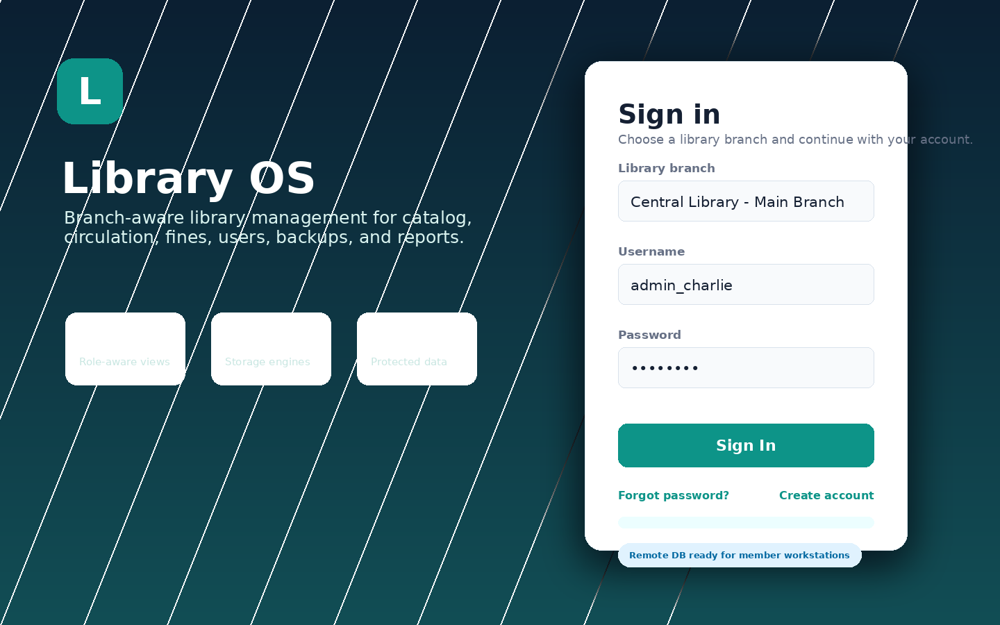
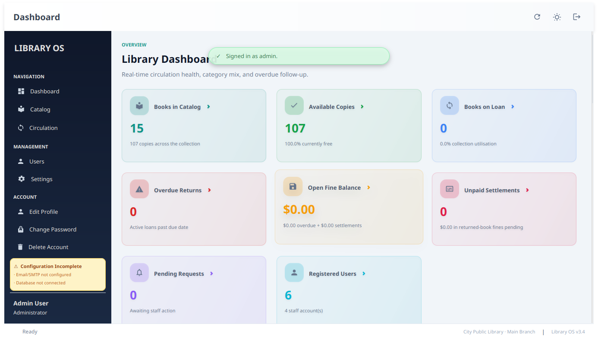
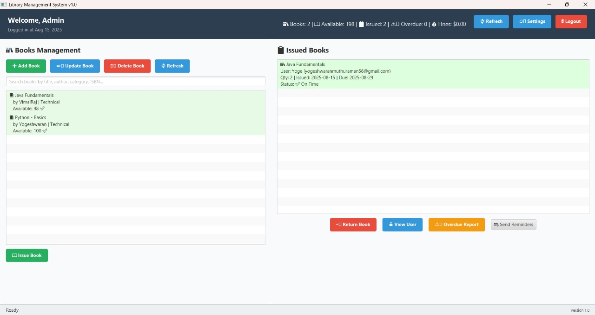

# LMSJavaFX

📚 A desktop Library Management System (LMS) built with JavaFX.  
✅ Manage books, users, and issue/return workflows in a clean GUI.

## ✨ Features

- 🔐 Staff login with validation and feedback
- 📚 Book management: add, update, delete, search, availability tracking
- 👤 User management: register users, view details, manage profiles
- 🔁 Issue/return workflow with due-date tracking
- 🔎 Search and filtering across lists
- 💾 Local data persistence in `data/` (`.ser` files)

## 🖼️ Screenshots

**Login Screen**  
Simple staff login with validation.



**Main Dashboard**  
Central workspace with quick actions and overview.



**Issued Books View**  
Track issued items and manage returns.



## ⚙️ Requirements

- JDK 25
- Internet access on first build (downloads dependencies)

## 🚀 Quick Start (IDE Run Button)

Import as a Maven project, then run:

- `com.example.application.LibraryApp` from the IDE, or
- the Maven goal `javafx:run`

If the IDE complains about JavaFX runtime, use the Maven goal:

```powershell
.\mvnw -q javafx:run
```

## 🧱 Build A Windows App Image (Recommended)

This creates a self-contained Windows app that runs without JavaFX installed:

```powershell
.\mvnw -q -DskipTests package -Pwindows
```

Run:

`target\installer\LibraryApp\LibraryApp.exe`

Distribute the whole folder:

`target\installer\LibraryApp\`

## 🗂️ Data Files

The app reads and writes data in `data/`.  
If you distribute the app image, keep `data/` next to the app folder:

```
target\installer\LibraryApp\
├── LibraryApp.exe
├── app/
├── runtime/
└── data/
```

## 🧭 Project Layout

```
LMSJavaFX/
├── src/
│   └── main/
│       └── java/
│           └── com/example/...
├── data/
│   └── *.ser
├── assets/
│   └── screenshots/
├── target/
│   └── installer/
│       └── LibraryApp/        (Windows app image)
├── pom.xml
└── README.md
```

## 🛠️ Troubleshooting

- **JavaFX runtime error on `java -jar`:**  
  Use the app image build instead (`package -Pwindows`). A plain jar does not bundle JavaFX runtime.

- **Maven not found:**  
  Use the Maven Wrapper included in this repo:
  ```powershell
  .\mvnw -v
  ```

## 📄 License

Apache License 2.0. See `LICENSE`.

## 👤 Author

Yogeshwaran

